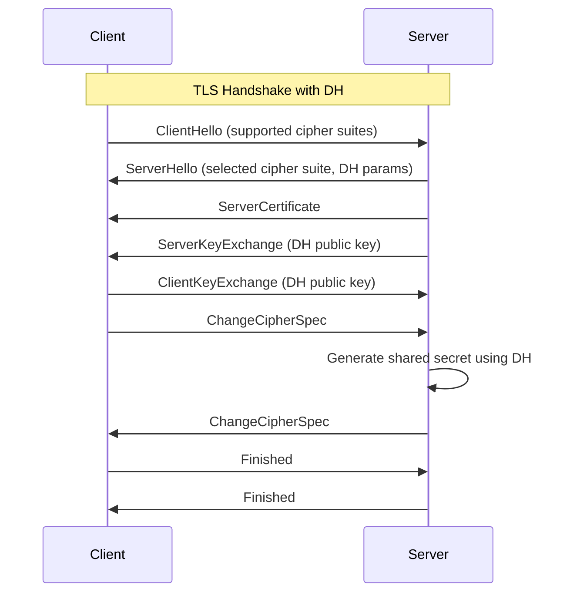

# Diffie-Hellman 密钥交换在 OpenVPN 中的应用

## 引言

Diffie-Hellman (DH) 密钥交换是一种革命性的密码学协议，由 Whitfield Diffie 和 Martin Hellman 于 1976 年提出。该协议允许两个通信实体在不安全的信道上安全地交换密钥，而无需预先共享秘密信息。在现代网络安全中，DH 协议是 TLS/SSL 握手过程中的核心组件之一，在 OpenVPN 等 VPN 系统中扮演着至关重要的角色。

本文将详细介绍 DH 密钥交换的数学原理、在 OpenVPN 中的具体应用、生成和使用方法、安全风险评估以及最佳实践建议。

## DH 密钥交换的数学原理

### 基本概念

DH 密钥交换基于离散对数问题的计算难度。协议涉及三个公开参数：

- **素数 p**：一个大素数
- **生成元 g**：模 p 的原根 (primitive root)
- **私钥**：Alice 和 Bob 各自选择的随机数

### 协议流程

假设 Alice 和 Bob 要建立共享密钥：

1. **参数协商**：双方同意使用相同的 p 和 g
2. **密钥计算**：
   - Alice 选择私钥 a，计算 A = g^a mod p
   - Bob 选择私钥 b，计算 B = g^b mod p
3. **公钥交换**：Alice 发送 A 给 Bob，Bob 发送 B 给 Alice
4. **共享密钥生成**：
   - Alice 计算 K = B^a mod p
   - Bob 计算 K = A^b mod p

由于 (g^a)^b = (g^b)^a = g^(ab) mod p，双方得到相同的共享密钥 K。

### 安全性证明

DH 协议的安全性基于**离散对数问题** (Discrete Logarithm Problem) 的计算难度：

- 已知 g、p 和 g^x mod p，要计算 x 非常困难
- 即使攻击者截获 A 和 B，也无法计算出 a、b 或共享密钥 K

## 在 OpenVPN 中的用途

### TLS 握手中的角色

OpenVPN 使用 TLS 协议建立加密连接，DH 密钥交换在 TLS 握手过程中发挥关键作用：



### OpenVPN 配置中的 DH 参数

在 OpenVPN 配置文件中，DH 参数通过 `dh` 指令指定：

```bash
# OpenVPN 服务器配置示例
port 1194
proto udp
dev tun

# TLS 相关配置
ca ca.crt
cert server.crt
key server.key
dh dh2048.pem  # DH 参数文件

tls-version-min 1.2
tls-cipher TLS-ECDHE-RSA-WITH-AES-256-GCM-SHA384:TLS-DHE-RSA-WITH-AES-256-GCM-SHA384
```

### 客户端是否需要配置 DH 参数？

**答案：通常不需要**

**服务器端必须配置**：
- OpenVPN 服务器必须配置 DH 参数文件
- DH 参数用于 TLS 握手过程中的密钥交换
- 服务器使用 DH 参数生成密钥交换材料

**客户端通常不需要配置**：
- OpenVPN 客户端通常不配置 DH 参数
- 客户端从服务器接收 DH 参数进行密钥交换
- 这是 TLS 协议的标准行为

**特殊情况下的客户端配置**：

1. **静态 DH 密钥交换 (已弃用)**：
   ```bash
   # 客户端配置 (仅用于旧版本或特殊需求)
   dh dh2048.pem  # 不推荐在客户端使用
   ```

2. **TLS 认证模式**：
   - 在某些高级配置中，客户端可能需要特定的 DH 参数
   - 但这不是标准配置

**最佳实践**：
- ✅ 服务器：始终配置 DH 参数
- ❌ 客户端：不要配置 DH 参数
- 📝 原因：DH 参数由服务器提供，客户端被动参与密钥交换

### 为什么 OpenVPN 需要 DH

1. **前向安全性 (Forward Secrecy)**：即使服务器私钥泄露，之前的会话密钥也不会被破解
2. **完美前向保密 (Perfect Forward Secrecy, PFS)**：每个会话使用独立的密钥
3. **抗量子计算攻击**：DH 协议对量子计算机有一定的抵抗力

## 生成和使用 DH 参数

### 生成 DH 参数

使用 OpenSSL 生成 DH 参数：

```bash
# 生成 2048 位 DH 参数（推荐生产环境使用）
openssl dhparam -out dh2048.pem 2048

# 生成 3072 位 DH 参数（更高安全性）
openssl dhparam -out dh3072.pem 3072

# 生成 4096 位 DH 参数（最高安全性）
openssl dhparam -out dh4096.pem 4096
```

**生成时间参考**：
- 2048 位：约 10-30 秒
- 3072 位：约 2-5 分钟
- 4096 位：约 10-30 分钟

### 验证 DH 参数

```bash
# 检查 DH 参数格式和有效性
openssl dhparam -in dh2048.pem -check

# 查看 DH 参数的文本表示
openssl dhparam -in dh2048.pem -text

# 显示参数信息
openssl dhparam -in dh2048.pem -noout -C
```

### 在 OpenVPN 中使用

1. **放置 DH 文件**：将生成的 DH 参数文件放置在 OpenVPN 配置目录中
2. **配置服务器**：在服务器配置文件中添加 dh 指令
3. **重启服务**：重新启动 OpenVPN 服务使新配置生效

```bash
# 示例配置
dh /etc/openvpn/dh2048.pem

# 对于高安全需求的环境
dh /etc/openvpn/dh3072.pem
```

### 性能考虑

DH 参数的大小影响性能：

| DH 参数大小 | 密钥交换时间 | 安全性等级 | 推荐用途 |
|-------------|--------------|------------|----------|
| 1024 位    | 最快         | 已弃用     | 仅测试   |
| 2048 位    | 中等         | 标准       | 生产环境 |
| 3072 位    | 较慢         | 高         | 高安全环境 |
| 4096 位    | 最慢         | 最高       | 极端安全需求 |

## 安全风险分析

### DH 参数泄露的风险

1. **中间人攻击 (MITM)**：
   - 攻击者可以使用泄露的 DH 参数进行中间人攻击
   - 截获和修改密钥交换过程

2. **降级攻击 (Downgrade Attack)**：
   - 强制客户端使用弱 DH 参数
   - 利用已知弱点的参数进行攻击

3. **长期影响**：
   - DH 参数通常在服务器运行期间保持不变
   - 泄露后影响所有新建立的连接

### 其他安全威胁

1. **弱参数攻击**：
   - 使用过小的素数 p
   - 非原根的生成元 g

2. **对数离散问题突破**：
   - 量子计算机可能在未来破解 DH
   - 目前推荐使用 ECDHE (椭圆曲线 DH)

3. **实现漏洞**：
   - 随机数生成器弱点
   - 侧信道攻击

### 风险缓解措施

1. **定期更换**：建议每年更换一次 DH 参数
2. **使用强参数**：至少使用 2048 位参数
3. **监控日志**：监控 OpenVPN 日志中的异常活动
4. **访问控制**：限制 DH 文件的访问权限

```bash
# 设置正确的文件权限
chmod 600 /etc/openvpn/dh2048.pem
chown openvpn:openvpn /etc/openvpn/dh2048.pem
```

## 最佳实践

### 参数选择

```bash
# 生产环境推荐配置
openssl dhparam -out dh2048.pem 2048

# 高安全环境
openssl dhparam -out dh3072.pem 3072
```

### 配置优化

#### 服务器配置最佳实践
```bash
# OpenVPN 服务器配置
port 1194
proto udp
dev tun

# TLS 配置 - 服务器必须配置 DH 参数
tls-version-min 1.2
tls-cipher TLS-ECDHE-RSA-WITH-AES-256-GCM-SHA384:TLS-DHE-RSA-WITH-AES-256-GCM-SHA384
dh dh2048.pem  # 必需：DH 参数文件

# 其他安全设置
remote-cert-tls client
crl-verify crl.pem
```

#### 客户端配置最佳实践
```bash
# OpenVPN 客户端配置
client
proto udp
dev tun
remote your-server.example.com 1194

# TLS 配置 - 客户端不需要配置 DH 参数
tls-version-min 1.2
tls-cipher TLS-ECDHE-RSA-WITH-AES-256-GCM-SHA384:TLS-DHE-RSA-WITH-AES-256-GCM-SHA384
# 注意：客户端不使用 dh 指令

# 其他设置
remote-cert-tls server
```

**配置要点**：
- ✅ **服务器**：必须配置 `dh` 参数
- ❌ **客户端**：不要配置 `dh` 参数
- 📝 **原因**：DH 密钥交换由服务器发起，客户端被动参与

### 监控和维护

1. **定期审计**：
   ```bash
   # 检查 DH 参数是否被修改
   ls -la /etc/openvpn/dh*.pem
   openssl dhparam -in /etc/openvpn/dh2048.pem -check
   ```

2. **日志监控**：
   ```
   grep "TLS" /var/log/openvpn.log
   grep "DH" /var/log/openvpn.log
   ```

3. **证书轮换策略**：
   - DH 参数：每年更换
   - 服务器证书：每年更换
   - CA 证书：多年有效但定期审计

## 参考资料

### RFC 文档

- **RFC 2631**: Diffie-Hellman Key Agreement Method
  - 定义了基本的 DH 密钥交换协议
  - https://tools.ietf.org/html/rfc2631

- **RFC 3526**: More Modular Exponential (MODP) Diffie-Hellman Groups for Internet Key Exchange (IKE)
  - 定义了标准 DH 组参数
  - https://tools.ietf.org/html/rfc3526

- **RFC 5114**: Additional Diffie-Hellman Groups for Use with IETF Standards
  - 提供了额外的 DH 组定义
  - https://tools.ietf.org/html/rfc5114

- **RFC 5246**: The Transport Layer Security (TLS) Protocol Version 1.2
  - TLS 协议规范，包含 DH 在 TLS 中的应用
  - https://tools.ietf.org/html/rfc5246

- **RFC 8446**: The Transport Layer Security (TLS) Protocol Version 1.3
  - TLS 1.3 规范，改进了密钥交换机制
  - https://tools.ietf.org/html/rfc8446

### OpenVPN 相关文档

- **OpenVPN 官方文档**: Security Overview
  - https://openvpn.net/community-resources/security-overview/

- **OpenVPN 安全强化指南**
  - https://openvpn.net/vpn-server-resources/advanced-option-settings/

### 学术论文

- **New Directions in Cryptography** (Whitfield Diffie & Martin Hellman, 1976)
  - DH 协议的原始论文
  - IEEE Transactions on Information Theory

- **The Discrete Logarithm Problem** (Andrew Odlyzko, 1985)
  - 关于离散对数问题难度的分析

### 工具和资源

- **OpenSSL 文档**: DH 参数生成
  - https://www.openssl.org/docs/manmaster/man1/dhparam.html

- **IANA 参数注册**: DH 组参数
  - https://www.iana.org/assignments/ikev2-parameters/ikev2-parameters.xhtml

---

本文档最后更新时间：2025年10月5日

**免责声明**：本文档仅供参考，不构成专业安全建议。在生产环境中使用前，请咨询专业安全专家。