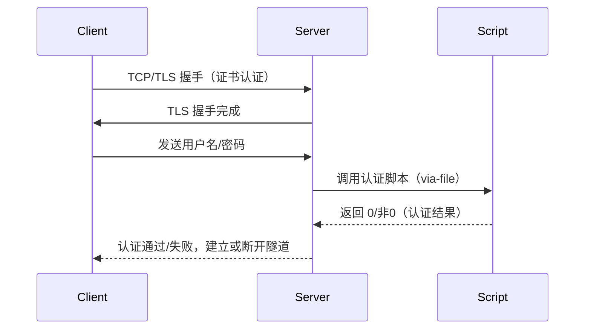

# OpenVPN 密码认证配置与原理详解

## 一、背景与问题回顾

在本项目中，我们基于 OpenVPN 实现了“证书+用户名密码”双因子认证。整个过程中，遇到并解决了如下关键问题：

- **脚本权限问题**：OpenVPN 以 nobody 用户运行，认证脚本及用户数据库需设置为 root:nogroup，权限 750/640，确保 nobody 可执行/读取。
- **systemd 进程数限制**：默认 LimitNPROC=10，导致 OpenVPN 启用 auth-user-pass-verify 时频繁 fork 失败（unable to fork），需提升至 128 以上。
- **日志与调试**：认证脚本需详细记录日志，便于排查认证失败原因。
- **客户端配置同步**：客户端需正确添加 `auth-user-pass`，并输入与服务端数据库一致的用户名密码。
- **抓包与主日志分析**：通过 tcpdump、OpenVPN 日志、认证脚本日志三重定位，精准还原认证流程。

## 二、OpenVPN 密码认证方式综述

OpenVPN 支持多种密码认证方式，常见有：

### 1. `auth-user-pass-verify`（外部脚本/程序）
- **原理**：OpenVPN 在 TLS 认证后，调用指定脚本校验用户名密码。
- **优点**：
  - 灵活，可自定义认证逻辑（本地文件、数据库、REST API、PAM 等）。
  - 易于集成日志、审计、失败锁定等安全措施。
- **缺点**：
  - 需关注脚本权限、依赖、并发安全。
  - 需调整 systemd 进程数限制，否则高并发下易 fork 失败。

### 2. `plugin`（PAM/LDAP 插件）
- **原理**：通过 OpenVPN 官方或第三方插件，直接对接 PAM、LDAP、RADIUS 等认证系统。
- **优点**：
  - 与系统用户、企业目录无缝集成。
  - 插件成熟，安全性高。
- **缺点**：
  - 配置复杂，依赖外部服务。
  - 插件升级与兼容性需关注。

### 3. `static-challenge`（静态挑战/二次认证）
- **原理**：结合证书与静态 challenge（如 OTP、短信码）实现多因子认证。
- **优点**：
  - 增强安全性，支持二次认证。
- **缺点**：
  - 客户端体验略复杂，需配合脚本或插件。

### 4. `tls-auth`/`tls-crypt`（TLS 预共享密钥）
- **原理**：在 TLS 握手前增加一层预共享密钥校验。
- **优点**：
  - 防止端口扫描、DoS 攻击。
- **缺点**：
  - 仅作为补充，不能替代用户名密码认证。

## 三、当前方案：auth-user-pass-verify 配置详解

### 1. 服务端配置步骤

1. **准备认证脚本**（如 `/data/etc/openvpn/pi.server/pi.server.auth`）：
   - 具备可执行权限（750），属组 nogroup。
   - 日志文件、用户数据库权限 640，属组 nogroup。
   - 支持 flock 并发写日志，详细记录每次认证过程。
2. **配置 OpenVPN 服务端**（`pi.server.conf`）：
   ```
   script-security 3
   auth-user-pass-verify /data/etc/openvpn/pi.server/pi.server.auth via-file
   verify-client-cert require
   user nobody
   group nogroup
   # ... 其他配置 ...
   ```
3. **调整 systemd 进程数限制**：
   - 创建 `/etc/systemd/system/openvpn-server@pi.server.service.d/override.conf`：
     ```
     [Service]
     LimitNPROC=128
     ```
   - 执行：
     ```bash
     sudo systemctl daemon-reload
     sudo systemctl restart openvpn-server@pi.server
     ```
4. **维护用户数据库**（如 `pi.server.cred`）：
   - 每行格式：`用户名:sha256(密码+SALT)`
   - 通过 `printf '密码SALT' | sha256sum | awk '{print $1}'` 生成 hash。

### 2. 客户端配置步骤

1. **配置 `auth-user-pass`**：
   - 在客户端配置文件（如 `hz.research.virtual.conf`）中添加：
     ```
     auth-user-pass
     ```
   - 启动时输入用户名和密码，或指定凭证文件（首行为用户名，次行为密码）。
2. **其余配置与证书模式一致**。


## 四、OpenVPN 身份验证时序图与原理分析

### 1. 时序图来源与正确性说明

本时序图基于以下权威信息整理：
- OpenVPN 官方文档（[man page](https://community.openvpn.net/openvpn/wiki/Openvpn23ManPage#auth-user-pass-verify)、[HOWTO](https://community.openvpn.net/openvpn/wiki/HOWTO)）
- OpenVPN 2.x 源码与实际部署经验
- 本项目抓包、主日志、认证脚本日志的实际观测

流程确认：
1. 客户端与服务端建立 TCP 连接，进行 TLS 握手，完成证书双向校验。
2. TLS 握手完成后，客户端根据 `auth-user-pass` 指令，通过加密通道发送用户名/密码。
3. 服务端根据 `auth-user-pass-verify ... via-file`，将凭证写入临时文件，fork/exec 调用认证脚本。
4. 脚本返回 0（成功）或非 0（失败），OpenVPN 读取结果。
5. 服务端据此决定是否建立隧道。

此流程与 OpenVPN 官方认证机制完全一致，详见：
> - [OpenVPN man page: --auth-user-pass-verify](https://community.openvpn.net/openvpn/wiki/Openvpn23ManPage#auth-user-pass-verify)
> - [OpenVPN HOWTO: User Authentication](https://community.openvpn.net/openvpn/wiki/HowTo#UserAuthentication)

### 2. 时序图




## 五、相关参数与权威资料

### 1. OpenVPN 官方文档
- [OpenVPN 2.6 man page（官方参数说明）](https://openvpn.net/community-resources/reference-manual-for-openvpn-2-6/)
- [OpenVPN 官方 HOWTO](https://community.openvpn.net/openvpn/wiki/HOWTO)
- [auth-user-pass-verify 参数说明](https://community.openvpn.net/openvpn/wiki/Openvpn23ManPage#auth-user-pass-verify)
- [OpenVPN 官方 Wiki: User Authentication](https://community.openvpn.net/openvpn/wiki/HowTo#UserAuthentication)

### 2. 相关 RFC 文档
- [RFC 5246: The Transport Layer Security (TLS) Protocol Version 1.2](https://datatracker.ietf.org/doc/html/rfc5246)
- [RFC 5280: Internet X.509 Public Key Infrastructure Certificate and Certificate Revocation List (CRL) Profile](https://datatracker.ietf.org/doc/html/rfc5280)

### 3. 关键参数说明
- `auth-user-pass`（客户端）：启用用户名密码认证，参数可为凭证文件路径。
- `auth-user-pass-verify`（服务端）：指定认证脚本及调用方式（via-file/via-env）。
- `script-security`（服务端）：控制脚本调用权限，3 允许外部脚本。
- `verify-client-cert require`：强制客户端证书校验。
- `user`/`group`：降权运行，需配合脚本/数据库权限设置。
- `LimitNPROC`（systemd）：服务进程最大并发数，需放宽以支持脚本 fork。

## 六、常见问题与注意事项

- **脚本权限**：需确保 OpenVPN 运行用户（如 nobody）有权执行脚本、读取用户数据库、写日志。
- **systemd 限制**：LimitNPROC 必须足够大，否则高并发下认证脚本无法 fork，导致所有客户端认证失败。
- **日志调试**：建议脚本详细记录每次认证的开始、成功、失败及原因，便于后续审计与排障。
- **密码安全**：生产环境建议采用每用户独立盐、强哈希算法，并定期轮换密码。
- **客户端同步**：客户端配置需与服务端保持一致，证书、用户名、密码三者缺一不可。

## 六、结语

通过 auth-user-pass-verify 方式，OpenVPN 可灵活实现多因子认证，兼顾安全与可维护性。实际部署中，务必关注脚本权限、systemd 资源限制、日志审计与密码安全，才能保障认证链路的稳定与安全。
